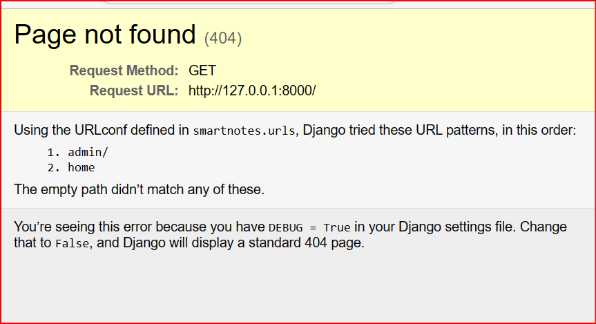
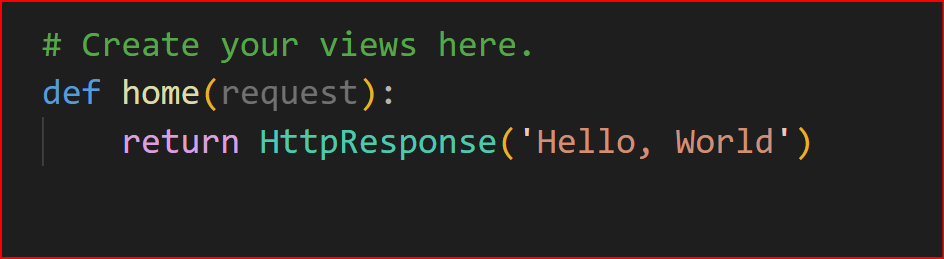
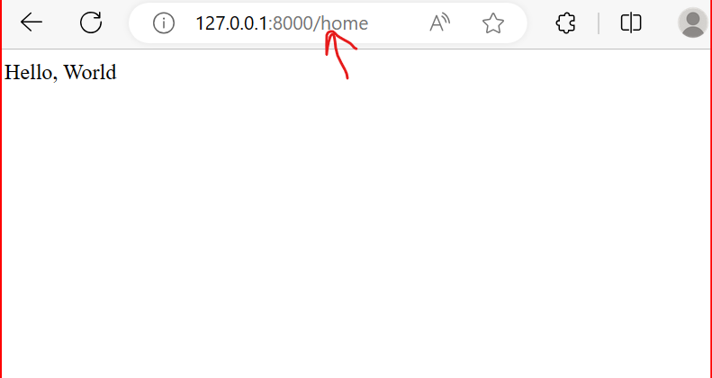

# Django Essential Training (LinkedIn course)
# [*Course Certificate*]()

In this course, you will learn how to create web applications using Django, a popular Python web framework. You will learn the basics of Django, such as how to use the Model-View-Template (MVT) design pattern, how to handle requests and responses, how to work with templates and databases, and how to create multiple apps within a project.

### What you need:

- Python 3.8 virtualenv
- Django 3.2
- Code editor
- Browser (Chrome)
- Familiarity with HTTP and its methods

### Create a new Django project:

1. Use the `django-admin startproject [name of the project]` command to create a folder of the project name and a `manage.py` file, which is the entry point of the project. You can run the project server through it.
2. Inside the project folder `smartnotes`, there are the configuration files.
3. In `settings.py`, there are many global variables defined. For example, `DEBUG = True` means that we are working in a development environment.
4. Now you can run the project using `python manage.py runserver` to run the server using the default configuration

### Create a minimum working page => First view:

1. Use the `django-admin startapp home` command to create a new app called `home`.
2. Every time you create an app, you need to add it to the `settings.py` file, so Django knows that this folder is part of the project. Under `INSTALLED_APPS`, add `'home',`.
3. Now you can start creating the first view of the project. Go to `home/views.py` and write your first function, which is a preconfigured file.
4. To know when to send requests for any function, you can go to `smartnotes/urls.py` file and import that file there to have access.
5. In `urls.py` in `smartnotes` folder, add the following: `from home import views` and inside `urlpatterns`, add a new path: `path('home', views.home)`.
6. Now if you run `python manage.py runserver` in localhost, you will see a `404` error, but you can still see the admin and home endpoints.

7. When you go to `/home` endpoint, you are making a request to that path, so Django will go to `urls.py` to see if it is ready to receive a request at this path. If it is, it will go to `views.py` file and then to the `def home` function. When the function receives the request, it will respond with its content, which is `Hello world` in our case.

8. Django uses the Model-View-Template (MVT) pattern, which is similar to the Model-View-Controller (MVC) pattern. In MVT, the model is the data layer that defines the structure and logic of the data. The view is the presentation layer that handles the user interface and interaction. The template is the HTML file that renders the view with dynamic data.

### Build the Django project => Template:

1. Create a folder called `templates` and inside it create another folder and name it as the app's name: `home`.
2. Inside `/templates/home`, create a file called `welcome.html` and inside it add a basic HTML page.
3. Go to `views.py` and use the function `render`.
4. The empty brackets are a way to pass down information from view to template: `{}`.
5. Pass the datetime module to pass today's date in the dictionary with a key called today.

### Apps and modularization:

1. You can have as many apps as you want, but organize them so each app is self-contained.
2. Create another `urls.py` file inside home app that is similar to the one we have in the smartnotes app. Use `include`.
3. Now if you delete the whole app, it will not give you any errors because the app is not imported in the smartnotes urls file, but by its own urls.
